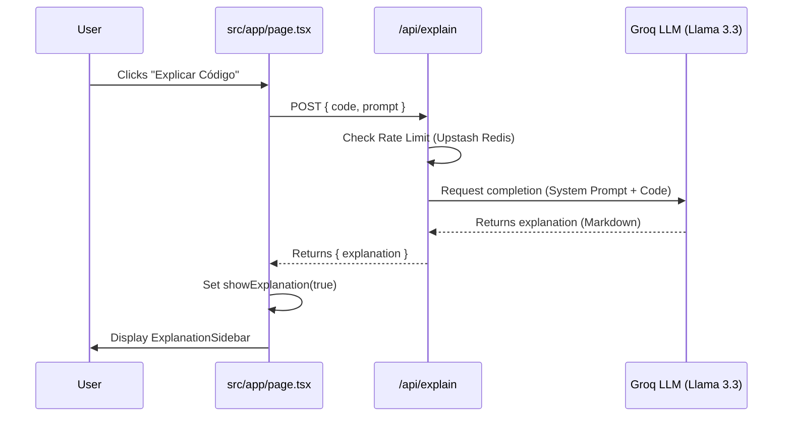

# Explain-to-Me Feature (CB-7)

The **Explain-to-Me** feature is an AI-powered educational tool designed to help developers understand the technical decisions behind the code generated by Codai Voice. It acts as a senior React/Next.js tutor, providing deep insights into layout choices, state management, accessibility, and best practices.

## How to Use

1. **Generate Code**: Use voice or manual input to generate a React component.
2. **Click the Lightbulb**: In the "Código Fonte" (Source Code) card, click the **"Explicar Código"** (Explain Code) button (represented by a lightbulb icon 💡).
3. **Read the Explanation**: A sidebar will slide in from the right containing a detailed, Markdown-formatted explanation of the generated code.

## Technical Architecture

The feature follows a client-server flow:

1. **Frontend**: `src/app/page.tsx` manages the state (`explanation`, `isExplaining`, `showExplanation`) and triggers the API call.
2. **API Route**: `src/app/api/explain/route.ts` handles the request, applying rate limiting and communicating with the Groq LLM.
3. **LLM**: Uses the `llama-3.3-70b-versatile` model via Groq SDK to generate the explanation based on a specialized "Tutor" system prompt.
4. **UI**: `src/app/components/ExplanationSidebar.tsx` renders the Markdown response using `react-markdown`.

### Sequence Diagram

## The "Tutor" Prompt

The AI is instructed to act as a **Senior React/Next.js Tutor**. The system prompt (`systemPrompt` in `src/app/api/explain/route.ts`) guides the model to focus on:

1.  **Layout Choices (CSS/Tailwind)**: Why specific classes were used (e.g., Flex vs Grid).
2.  **State Management (Hooks)**: Explanation of `useState`, `useEffect`, etc.
3.  **HTML Semantics**: Importance for accessibility and SEO.
4.  **Best Practices**: Clean Code patterns applied.

**Constraints:**
- Responses are always in **Portuguese (Brazil)**.
- Uses Markdown for formatting and code blocks.
- Tone is encouraging and educational.

## Infrastructure Dependencies

- **Groq API**: For LLM inference.
- **Upstash Redis**: For rate limiting (sliding window: 5 requests per 60 seconds).
- **Tailwind CSS & Lucide React**: For the UI components.
- **React Markdown**: For rendering the AI response.
